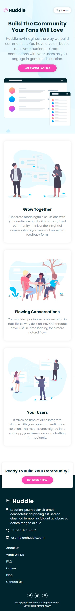
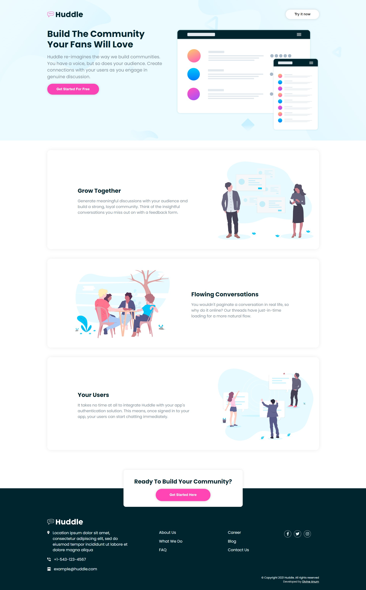

# Frontend Mentor - Loopstudios landing page solution

Took a quick Frontend Mentor Challenge to grasp the concept of Styled Components.

## Table of contents

- [Overview](#overview)
  - [Screenshots](#Screenshots)
  - [Links](#links)
- [My process](#my-process)
  - [Built with](#built-with)
  - [What I learned](#what-i-learned)
- [Author](#author)

## Overview

### Screenshots

### Links

- Solution URL: [My solution](https://github.com/CHR-onicles/FEM-huddle-landing-page)
- Live Site URL: [Live site](https://lpstudios-lp.vercel.app)

## My process

### Built with

- React
- Styled Components

### What I learned

I reinforced knowledge on responsiveness.

## Author

- Website - [CHR-onicles](https://github.com/CHR-onicles)
- Frontend Mentor - [@CHR-onicles](https://www.frontendmentor.io/profile/CHR-onicles)
